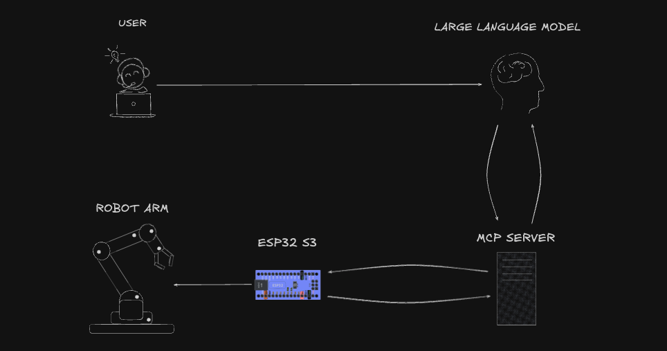

  

  

## Proje Hakkında
Projenin temel mantığı, LLM'i robotun "beyni", ESP32'yi ise bu beynin emirlerini yerine getiren "sinir sistemi ve kasları" olarak konumlandırmaktır. Kullanıcı olarak siz, beyne doğal dilde komutlar vereceksiniz (örn: "masadaki kalemi al"), LLM bu komutu yorumlayacak ve ESP32'nin anlayacağı teknik komutlara dönüştürecektir.
